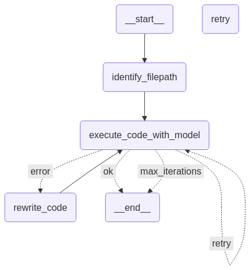

# Code correction Agent
> Create an agent that can run a python script and correct any errors it might have.

---
## Init 
Before you can run the project. You need to create the python file you are checking for errors.  
E.g. `error_script.py` with the following code:
```python
x = 2
y = "test"
print(x + y)
```

## Execute
The file you are testing need to be placed same as where you execute the code.

```shell
uv run --env-file=.env src/main.py
```

### List the repository root
```shell
ll
total 228K
-rw-rw-r-- 1 kasper kasper   34 Mar 11 11:05 error_script.py
-rw-rw-r-- 1 kasper kasper 1.8K Mar  7 13:07 pyproject.toml
-rw-rw-r-- 1 kasper kasper  483 Mar 11 11:32 README.md
drwxrwxr-x 5 kasper kasper 4.0K Mar 11 11:04 src
drwxrwxr-x 3 kasper kasper 4.0K Mar  7 13:13 tests
-rw-rw-r-- 1 kasper kasper 208K Mar  7 13:06 uv.lock
~/developer/github.com/kaaquist/test-agents master
```

### The Graph
This here is the Graph  

